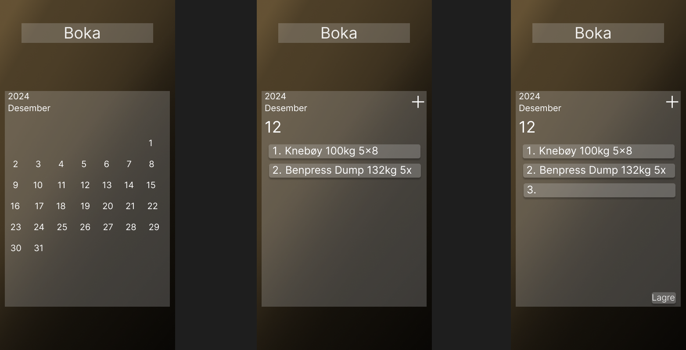
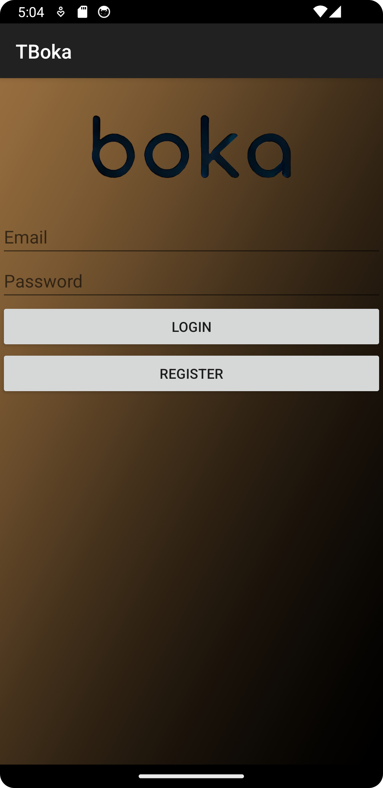
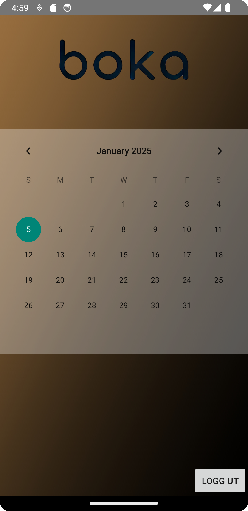
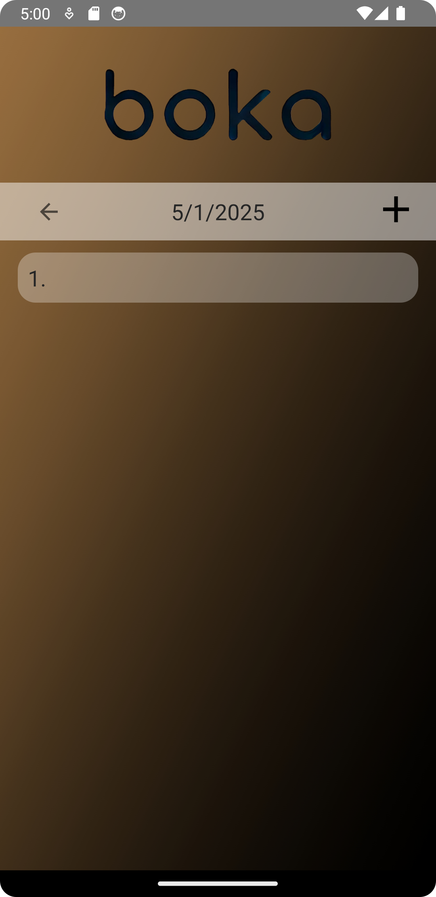
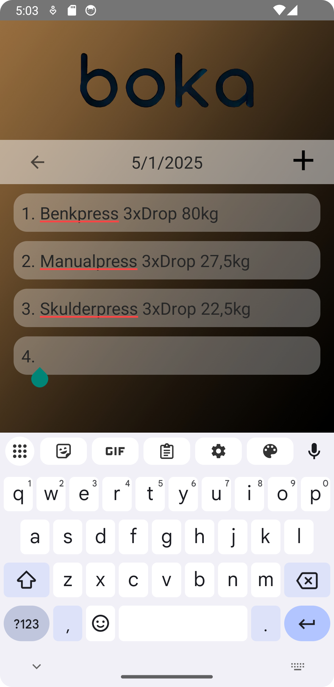

This is a simple diary app meant for personal use as a workout diary. 
In this readme you can read what technologies i have used, and see images as well as the prototype of the app. I will also discuss what i would do to improve the app if it was to be used publicly.

**Technology used**\
It is developed in Android Studio using Kotlin. For data handling, i utilized Google's free version of Cloud firestore. This decision was because i did not need many writes and reads, and it was easily available. Some time into the project, some friends and family noted that they wanted to use the app themselves, so i had to extend the functionality to handle multiple users. It was natural to use Google's Firebase authentication, and add a functionality for logging in and registering based on an e-mail address and a custom password. I also now had to add some rules to the cloud, to prevent users from accessing other users data.

**Figma prototype**\
Before the project, i used Figma to sketch a simple prototype. This was primarily to explore color choices and mapping of components. Her is a link you can use to access the flow of the prototype, and underneath are some screenshots of the prototype.
https://www.figma.com/proto/DGHq48vwqGx01fiKz4p9qv/Boka?node-id=0-1&t=7KYJsThaTQYjIiZu-1

**App screenshots**\
This is the login activity. If the user is new, or logged out, they will be directed to this activity, and has to enter correct information to be sent to the main activity. If the user already is logged in to a session, they skip this and is directed to the main activity.

This is the main activity. It is nothing else than a calendar, where the user can choose which date they want to write a post in. The user presses the selected date, and is sent to the date activity.

These next two images are the date activity presented both without content and with content. You see that a blank date with no content already has an empty post, so the user don't have to press the add-button(plus-sign) before writing. This is also intended to help new users get started, in case they miss the add-button. This activity also has the functionality that if a post is without user-made content, the post in question will be deleted when the user goes back to the calendar or closes the app. This is to minimize unnecessary data stored. Users can create as many posts as they want to in a selected date, and all posts will be numbered as a list.

